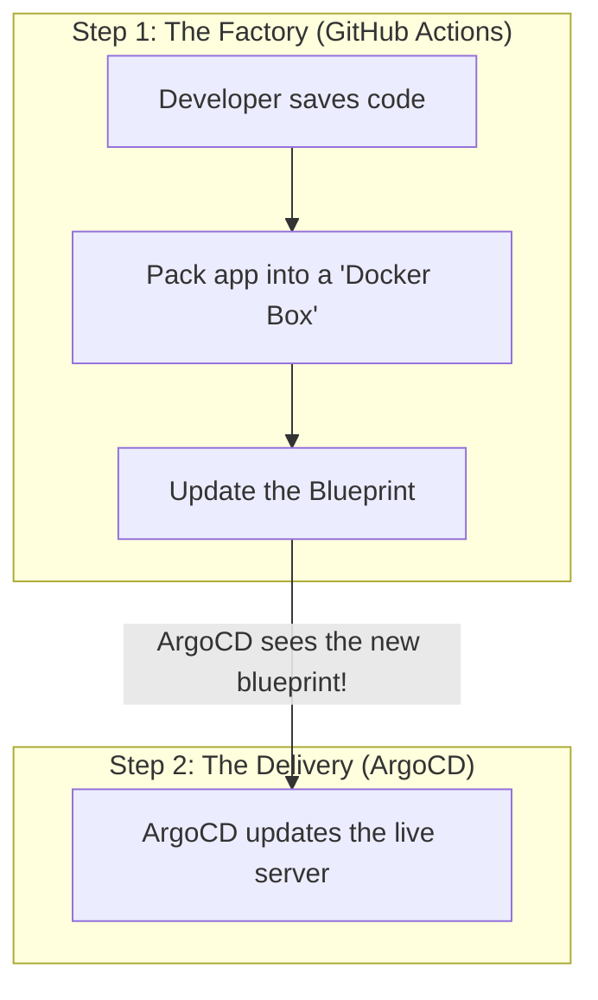

# 🎓 The Absolute Beginner's Guide to Deploying PureSecure

Welcome! If you are reading this, you might be wondering: *"We have a bunch of code. How does this code actually get onto the internet so people can use it? Fast? Securely? Without breaking everything?"*

This document is written for **complete beginners**. Think of me as your teacher. We are going to walk through the entire journey of our code—from the moment you hit "Save" on your laptop, to the moment a user visits `puresecure.reondev.top` on their phone.

Let's break it down using simple analogies!

---

## 1. The Big Picture: What is GitOps?

Historically, when a programmer finished writing an app, they would manually log into a physical server computer, drag and drop their files, and type complex commands to start the app. If the server crashed in the middle of the night, the app stayed dead until the programmer woke up.

Today, we use **GitOps**. 
**GitOps** means that this Git repository (the folder you are looking at right now) acts as the single "Source of Truth" or **Master Blueprint**. 

We have a robot named **ArgoCD** living inside our server. ArgoCD’s only job is to constantly compare our server to our Git repository. 
- If the repository says "We need 3 copies of the app running," and the server only has 2, ArgoCD builds the 3rd one automatically.
- If a hacker logs into the server and deletes our app, ArgoCD instantly notices the server doesn't match the Git blueprint anymore, and recreates the app within 3 minutes!

### The Two-Step Dance (CI / CD)


---

## 2. Step 1: The Factory (Continuous Integration)

When you push new code to GitHub, a factory automation process called **GitHub Actions** wakes up.

1. **Safety Checks (Linting):** First, it reads your code to make sure there are no typos or glaring security holes.
2. **Boxing it up (Docker Container):** It wraps your entire application, along with the specific version of Python it needs, into a standardized shipping container called a **Docker Image**. This guarantees that if the app works on your computer, it will work *exactly* the same way on the server.
3. **Updating the Blueprint:** The factory updates a text file in this repository called `values.yaml` to say: *"Hey, the newest version of the box is version #123!"*

---

## 3. Step 2: The Hotel Manager (Kubernetes & ArgoCD)

Our application is eventually deployed to **Kubernetes**. 

Think of Kubernetes as a massive, automated **Hotel Manager**. Instead of renting one giant computer, Kubernetes uses a cluster of small computers and organizes them. 

When ArgoCD sees that the `values.yaml` blueprint was updated to version #123, it tells Kubernetes to apply the changes.

### What actually gets built inside the Hotel?

When the blueprint is read, Kubernetes creates these specific things:

1. **Deployment (The Rooms & Workers):** 
   This tells the Hotel Manager how many copies (Pods) of your app to run. If one app crashes because of a bug, the Deployment automatically throws it in the trash and spins up a brand-new identical clone in seconds.
   
2. **Service (The Receptionist):** 
   If you have 5 copies of your app running, which one should answer a user's request? The **Service** acts as the receptionist. It provides one single internal phone number and automatically routes incoming traffic to whichever app copy is currently least busy.

3. **IngressRoute / Traefik (The Front Door Bouncer):** 
   The pods and the receptionist are hidden deep inside the hotel. The **IngressRoute** is the bouncer at the public front door. When someone types `https://puresecure.reondev.top` into their browser, the IngressRoute checks their request, secures it with an SSL padlock (HTTPS), and escorts them to the receptionist.

---

## 4. How do we Handle Passwords? (Secrets Management)

Our app needs passwords to survive. For example, it needs the `SERVICE_API_KEY` to talk to our database, and specific Azure IDs to allow users to "Log in with Microsoft."

**The Bad Way:** We could just type the passwords directly into our Git Repository. But then anyone who reads our code on GitHub would steal our passwords!

**The PureSecure Way (Azure Key Vault & ESO):**
We keep our passwords locked inside a deeply secure digital vault in the cloud called **Azure Key Vault**. 

But how does our app get the passwords *out* of the vault without needing a password to open the vault?
1. **The ID Badge (Workload Identity):** We give our application a mathematically unique, password-less "ID Badge" linked to Azure identity systems.
2. **The Courier (External Secrets Operator - ESO):** We employ a robotic courier (ESO). 
3. **The Transaction:** The courier takes the ID badge, walks over to the Azure Key Vault, says *"I am the PureSecure app, here is my un-forgeable badge,"* and is handed the passwords. The courier then carefully hands them directly to our app's memory inside the hotel. 

Here is what the command for the Courier looks like in our code (notice there are no passwords here!):
```yaml
apiVersion: external-secrets.io/v1
kind: ExternalSecret
metadata:
  name: app-secrets
spec:
  target:
    name: app-secrets # Create a local hidden file for our app
  data:
    - secretKey: SERVICE_API_KEY # Name the app expects
      remoteRef:
        key: service-api-key     # Which vault drawer to open in Azure
```

---

## 5. Working on your Laptop (Docker Compose)

 *"All this Cloud Hotel and Robot Courier stuff sounds incredibly complicated. How do I just test my code on my laptop?"*

Great question! This is where **Docker Compose** comes in.

We have a file called `docker-compose.yml`. It acts as a miniature, fake version of the entire cloud ecosystem that runs right on your computer.

When you type:
```bash
docker compose up web --build
```
Here is the magic it performs:
1. **Faking the Vault:** Instead of talking to Azure Key Vault, it just reads a local file named `.env` hidden on your laptop to get the test passwords.
2. **Ghost-Mounting (Hot Reload):** It creates an invisible bridge between the code on your laptop and the fake container. If you change the color of a button in `style.css` on your laptop, the app inside Docker instantly sees the change and updates in 6 milliseconds. You never have to manually restart it or upload anything!

---

## Summary

1. You write code and test it locally on your laptop utilizing **Docker Compose**.
2. When you push your code to GitHub, **GitHub Actions** tests it and packs it into a Box.
3. **ArgoCD** realizes a new Box exists and tells **Kubernetes**.
4. **Kubernetes** securely fetches passwords from **Azure** using an ID badge.
5. And finally, the app replaces the old version with the new version without any users even noticing.

Welcome to modern software deployment!
