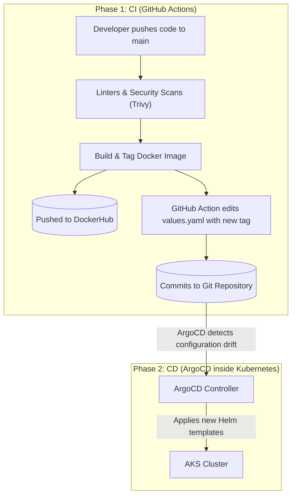

# 🚀 Practical Deployment & GitOps Guide

This document breaks down the **PureSecure CWE Explorer** deployment architecture from an academic perspective into practical, tangible, operational concepts. It explains *exactly* what is happening under the hood when code is deployed, giving you clear examples and YAML snippets.

The ecosystem utilizes a GitOps approach powered by **Kubernetes (AKS)**, **ArgoCD**, **Helm**, **External Secrets Operator (ESO)**, and **Azure Workload Identity**.

---

## 1. What is GitOps? (Architectural Overview)

In standard server deployments, an engineer often logs into a server and types `docker run`, or types `kubectl apply -f deployment.yaml` against a cluster. This is called **Imperative** infrastructure.

**GitOps is Declarative.** Instead of pushing commands to a server, you define exactly what the server *should* look like within this Git repository. A synchronization agent (ArgoCD) runs constantly inside the cluster, watching this repository. If the live server ever stops matching the Git code, ArgoCD automatically corrects it. 

### Visual Pipeline Flow


---

## 2. Bootstrapping the Cluster (The Practical Commands)

You cannot use GitOps if the cluster doesn't know what ArgoCD is. To initially bootstrap a totally empty cluster, a human operator executes the following setup once:

### Step A: Install External Secrets Operator (ESO)
Before deploying our custom `SecretStore`, the cluster needs to understand what that is. We install the ESO controllers and custom schemas (CRDs) via Helm.
```bash
helm repo add external-secrets https://charts.external-secrets.io
helm install external-secrets external-secrets/external-secrets \
    -n external-secrets --create-namespace \
    --set installCRDs=true
```

### Step B: Build the Security Boundary
We teach ArgoCD which repositories it is allowed to read from and which Kubernetes namespaces it is allowed to write to.
```bash
# Deploys the AppProject boundary definitions
kubectl apply -f argocd/project.yaml
```

### Step C: Trigger the GitOps Sync
We tell ArgoCD to start tracking the `helm/puresecure` directory in this GitHub repository.
```bash
# Registers our Helm chart folder to ArgoCD
kubectl apply -f argocd/application.yaml
```
*What happens next?* ArgoCD will now autonomously read `helm/puresecure/values.yaml` and instruct Kubernetes to create the Deployments, Services, and Ingress routes seamlessly.

---

## 3. Secrets Management: Workload Identity & ESO

Storing passwords inside Git or default Kubernetes `Secrets` is highly insecure because they are just base64 encoded strings. Instead, we use **Azure Key Vault**. But how does the cluster authenticate to Azure without using a static password?

We use **Azure Workload Identity**, which allows a Kubernetes `ServiceAccount` to mathematically act as an Azure identity using OIDC federation. 

### How it Works in Practice:

1. **The ServiceAccount Mapping**:
   Kubernetes creates a `ServiceAccount` annotated with the Azure Client ID. 
   ```yaml
   apiVersion: v1
   kind: ServiceAccount
   metadata:
     name: puresecure-sa
     annotations:
       azure.workload.identity/client-id: "1234abcd-xxxx-xxxx-xxxx-xxxxxxxxxxxx"
   ```

2. **The SecretStore (How to authenticate)**:
   We configure the External Secrets Operator to use Azure Workload Identity to log in to our specific Key Vault URL. Notice the explicit `tenantId`.
   ```yaml
   apiVersion: external-secrets.io/v1
   kind: SecretStore
   metadata:
     name: azure-keyvault
   spec:
     provider:
       azurekv:
         authType: WorkloadIdentity
         vaultUrl: "https://kv-puresecure-prod.vault.azure.net"
         serviceAccountRef:
           name: puresecure-sa
         tenantId: "xxxx-your-tenant-id-xxxx"
   ```

3. **The ExternalSecret (What to fetch)**:
   We tell ESO to pull the `service-api-key` out of Azure and automatically generate a standard Kubernetes `Secret` object named `app-secrets` locally in the cluster.
   ```yaml
   apiVersion: external-secrets.io/v1
   kind: ExternalSecret
   metadata:
     name: app-secrets
   spec:
     refreshInterval: 0.5h
     target:
       name: app-secrets # The name of the K8s Secret it creates
     data:
       - secretKey: SERVICE_API_KEY # The local K8s key
         remoteRef:
           key: service-api-key     # The name inside Azure Key Vault
   ```

---

## 4. Understanding the Kubernetes Resources Created

When ArgoCD finishes synchronizing the Helm chart, the following components are physically generated inside the `puresecure` namespace:

1. **Deployment (`puresecure`)**: Controls the FastAPI Pods. It pulls the image specified in `values.yaml`, specifies that we require `100m` of CPU, limits the container to run as the secure `appuser`, and monitors `/api/health` to know if the python application crashed.
2. **Service (`puresecure`)**: Provides a static internal network IP so other pods in the cluster can find the ephemeral FastAPI pods as they scale up and down.
3. **IngressRoute (`puresecure-ingress`)**: A routing rule used by Traefik. It acts as the bouncer for the internet. If you navigate to `puresecure.reondev.top`, the IngressRoute accepts the traffic, terminates the HTTPS TLS connection, and securely passes the HTTP traffic to the internal Service.

---

## 5. Local Docker Development (How `docker-compose.yml` Works)

When writing code locally, developers do not use Kubernetes. We use Docker Compose, which has been massively optimized for "Hot Reloading".

Take a look at how `docker-compose.yml` mounts the volumes:
```yaml
services:
  web:
    build: .
    volumes:
      - ./app:/app/app:ro
      - ./data:/app/data
    command: ["uvicorn", "app.main:app", "--host", "0.0.0.0", "--port", "8000", "--reload"]
```

### Explaining the Magic:
1. **Live "Hot-Reloading"**: By mounting `./app:/app/app:ro`, the code operating inside the Linux container is physically linked to your Windows/Mac folder. When you hit "Save" on a python file locally, `uvicorn --reload` instantly restarts the web server in under six milliseconds, without you ever running `docker compose build`. 
2. **Permissions Independence**: Rather than burying the SQLite database securely inside a locked Docker Volume, it is mapped natively via `./data:/app/data`. You can open your local `/data` folder on your desktop and actively watch the `.xml.zip` files download, or open the SQLite DB in a database browser freely.
