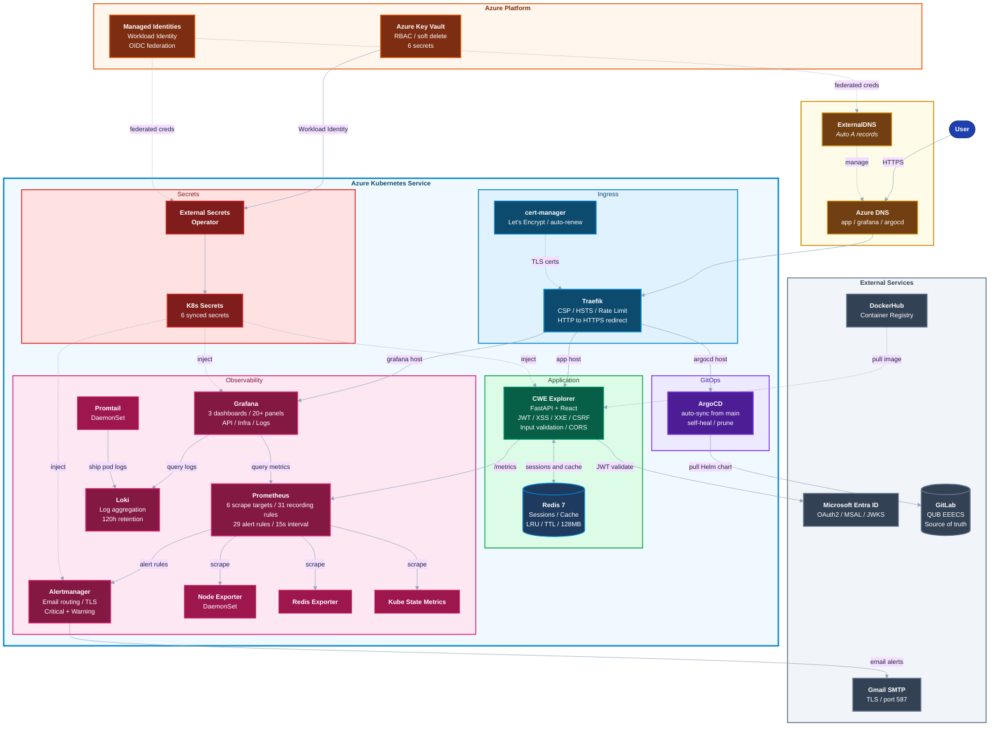
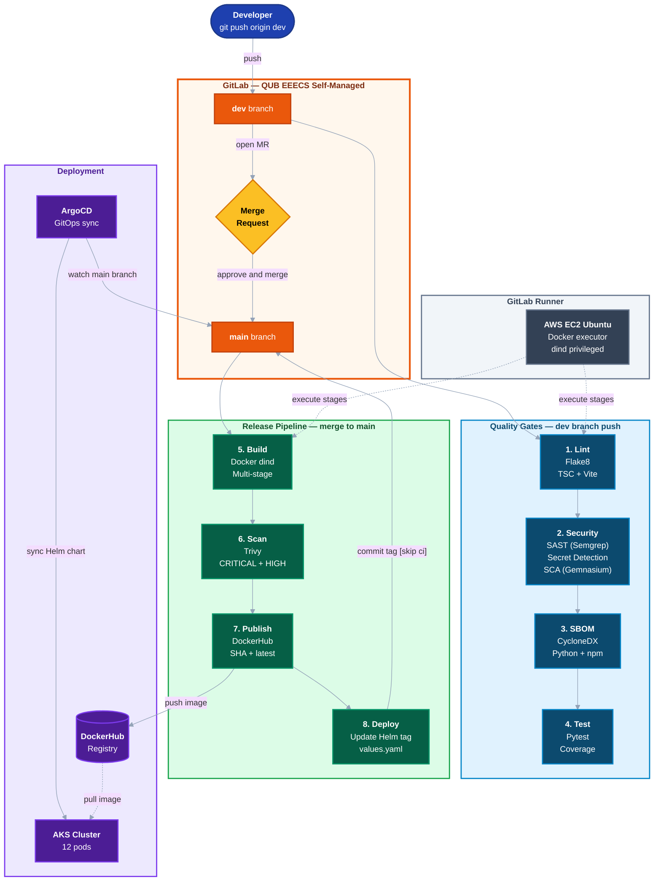

# PureSecure CWE Explorer

Search, browse, and analyse CVE and CWE vulnerability data.

---

## Application security

| Control | Description |
|---------|-------------|
| Microsoft Entra ID (MSAL) | RS256 JWT validation against Azure JWKS. API keys compared with `secrets.compare_digest` (constant time) |
| Concurrent user limits | Sessions tracked per user in Redis with 30 min TTL. Returns 429 when the limit is hit |
| XSS prevention | CSP locks scripts to `self`, blocks objects and framing. X-XSS-Protection and nosniff headers set. React does not use `dangerouslySetInnerHTML` |
| XXE prevention | All XML parsing goes through `defusedxml.ElementTree` (CWE-611). External entities are blocked |
| Input validation | CVE/CWE IDs checked by regex. Free text queries capped at 200 chars, stripped to alphanumeric plus spaces, hyphens, dots |
| SQL/Command injection | Inputs stripped of `;` `'` `"` and other metacharacters. No SQL database exists (Redis + in-memory). NVD API calls use parameterised requests |
| CSRF protection | Auth uses stateless JWTs in the Authorization header, not cookies. API is GET only with `allow_credentials=False` |
| Path traversal prevention | SPA fallback uses `os.path.realpath` with prefix check. Paths like `.env`, `.git`, `terraform/` return 404 |
| CORS | Locked to application origin, GET only, no credentials |
| Rate limiting | Traefik middleware, 100 avg / 200 burst per minute |
| Security headers | HSTS (1 year, preload, subdomains), `upgrade-insecure-requests`, server banner stripped |
| Security tests | 24+ tests for XSS payloads, SQL injection strings, format validation, Unicode bypass |

## Infrastructure security

| Control | Description |
|---------|-------------|
| TLS | Let's Encrypt via cert-manager. HTTP permanently redirects to HTTPS |
| Secrets management | External Secrets Operator pulls from Azure Key Vault using Workload Identity. No credentials stored in the cluster |
| Container hardening | `runAsNonRoot: true`, `allowPrivilegeEscalation: false`, read only filesystem where possible |
| RBAC | Kube State Metrics can only `list` and `watch` |
| Image security | All tags pinned (no `:latest`), `imagePullPolicy: Always`, resource limits set on every pod |
| Monitoring | Prometheus, Grafana, Loki. Metrics, dashboards, and logs in one place for auditing |
| Alerting | Alertmanager sends email over TLS. SMTP credentials come from Key Vault |
| CI/CD security | Semgrep SAST, secret detection, Gemnasium dependency scanning, Trivy container scan, CycloneDX SBOM |

---

## Infrastructure decisions

| Tool | Purpose |
|------|---------|
| AKS | Managed Kubernetes with Workload Identity and OIDC |
| Terraform | Provisions AKS, Key Vault, Managed Identities, RBAC |
| Helm | 42 templates in a single chart |
| ArgoCD | GitOps, auto syncs from `main` branch |
| GitLab CI | 8 stage pipeline: lint, security, sbom, test, build, scan, publish, deploy |
| Self-hosted GitLab Runner | Docker executor on AWS EC2 Ubuntu VM |
| Traefik | Ingress controller, IngressRoute CRDs, middleware chain |
| cert-manager | TLS certificates from Let's Encrypt, auto renewal |
| ExternalDNS | DNS A record management in Azure DNS |
| External Secrets Operator | Syncs Key Vault secrets into Kubernetes |
| Docker / DockerHub | Image builds and registry |
| Redis | Session store and cache, LRU eviction |
| Prometheus | Scrapes metrics from app, Redis, node, Kubernetes |
| Grafana | Three dashboards: API, Infrastructure, Logs |
| Loki + Promtail | Log aggregation and shipping |
| Alertmanager | Alert routing, email via Gmail SMTP |
| Locust | Load testing |
| Trivy | Container image vulnerability scanning in CI |
| Semgrep (SAST) | Static analysis via GitLab template |
| Gemnasium (SCA) | Dependency scanning via GitLab template |
| GitLab Secret Detection | Catches secrets before they get committed |
| CycloneDX | SBOM generation for Python and frontend dependencies |

---

## Architecture



## CI/CD pipeline



---

## Prometheus metrics

### Scrape targets (15s interval)

| Target | Endpoint | Metrics |
|--------|----------|---------|
| CWE Explorer | `web:8000/metrics` | `http_requests_total`, `http_request_duration_seconds`, `http_requests_in_progress` |
| Prometheus | `localhost:9090` | Internal Prometheus metrics |
| Alertmanager | `alertmanager:9093` | Alertmanager health and notification metrics |
| Node Exporter | `node-exporter:9100` | CPU, memory, disk, network per node |
| Kube State Metrics | `kube-state-metrics:8080` | Pod status, container restarts, deployments |
| Redis Exporter | `redis-exporter:9121` | Memory usage, hit rate, ops/sec, evictions |

### Recording rules

| Group | Rules | Examples |
|-------|-------|---------|
| Request rates | 4 rules | `cwe:http_requests:rate1m`, by endpoint, by status, detailed 5m |
| Error rates | 4 rules | `cwe:http_errors_5xx:rate1m`, `cwe:http_error_ratio_5xx`, 4xx equivalents |
| Latency | 6 rules | `cwe:http_latency_p50/p90/p95/p99:5m`, p95 by endpoint, avg by endpoint |
| Availability | 5 rules | `cwe:http_availability:5m`, in-progress total, requests total |
| Node infra | 5 rules | `infra:node_cpu_usage:percent5m`, memory, disk, network rx/tx |
| Kubernetes | 3 rules | `infra:pods_running:count`, not running, container restarts |
| Redis | 4 rules | `infra:redis_memory_usage:ratio`, hit rate, ops/sec, evictions |

---

## Alert rules (29 rules, 6 groups)

### Application alerts

| Alert | Severity | Condition |
|-------|----------|-----------|
| APIDown | Critical | `up{job="cwe-explorer"} == 0` for 2m |
| HighServerErrorRate | Critical | 5xx error ratio > 5% for 2m |
| HighClientErrorRate | Warning | 4xx error ratio > 25% for 5m |
| LowAvailability | Critical | Availability < 99% for 5m |
| HighP95Latency | Warning | p95 latency > 1s for 5m |
| CriticalP95Latency | Critical | p95 latency > 5s for 2m |
| HighP99Latency | Warning | p99 latency > 3s for 5m |
| SlowEndpoint | Warning | Endpoint p95 > 2s for 5m |
| NoTraffic | Warning | Request rate = 0 for 10m |
| HighConcurrency | Warning | In-progress requests > 50 for 2m |
| TrafficSpike | Critical | 10x above 1h average for 2m |

### Infrastructure alerts

| Alert | Severity | Condition |
|-------|----------|-----------|
| NodeHighCPU | Warning | CPU > 80% for 10m |
| NodeCriticalCPU | Critical | CPU > 90% for 5m |
| NodeHighMemory | Warning | Memory > 85% for 5m |
| NodeCriticalMemory | Critical | Memory > 95% for 2m |
| NodeDiskSpaceWarning | Warning | Disk > 75% for 5m |
| NodeDiskSpaceCritical | Critical | Disk > 90% for 2m |
| NodeExporterDown | Critical | Node exporter unreachable for 2m |
| PodNotRunning | Warning | Pod not in Running/Succeeded for 5m |
| PodFailed | Critical | Pod in Failed phase for 1m |
| ContainerFrequentRestarts | Warning | > 3 restarts/hour |
| KubeStateMetricsDown | Critical | KSM unreachable for 2m |
| RedisDown | Critical | Redis unreachable for 1m |
| RedisHighMemory | Warning | Memory > 80% of max for 5m |
| RedisCriticalMemory | Critical | Memory > 95% of max for 2m |
| RedisLowHitRate | Warning | Hit rate < 80% for 10m |
| RedisEvicting | Critical | Eviction rate > 0 for 5m |
| PrometheusPVCDiskWarning | Warning | /prometheus > 70% for 5m |
| PrometheusPVCDiskCritical | Critical | /prometheus > 85% for 2m |

### Alertmanager routing

| Receiver | Severity | Group Wait | Repeat Interval |
|----------|----------|------------|-----------------|
| email-critical | Critical | 10s | 1h |
| email-warning | Warning | 30s | 4h |

Grouped by `alertname` and `severity`. Sent over Gmail SMTP with TLS. When a critical alert fires, inhibition rules suppress the corresponding warnings (APIDown silences latency warnings, for example).

---

## Grafana dashboards

### API dashboard

Shows total requests, 2xx/4xx/5xx breakdowns, requests per second by endpoint, traffic over time (stacked), and pie charts for endpoint, method, and status code distribution.

### Infrastructure dashboard

Pod status, node CPU and memory across nodes, container restart counts, Redis memory usage, and cache hit rate.

### Logs dashboard

Pulls from Loki. Promtail ships all pod logs. 120 hour retention, filterable by namespace, pod, and container.

---

## API endpoints

### Public (no auth)

| Method | Path | Description |
|--------|------|-------------|
| GET | `/api/health` | Liveness probe |
| GET | `/api/config` | MSAL client config (client_id, tenant_id) |
| GET | `/api/services` | External service URLs (Grafana, ArgoCD) |
| GET | `/metrics` | Prometheus metrics |

### Protected (JWT required)

| Method | Path | Description |
|--------|------|-------------|
| GET | `/api/cwe` | Search CWEs (query, limit) |
| GET | `/api/cwe/featured` | 29 curated CWEs (OWASP Top 10) |
| GET | `/api/cwe/suggestions` | Autocomplete suggestions |
| GET | `/api/cwe/{cwe_id}` | CWE detail |
| GET | `/api/cwe/{cwe_id}/cves` | CVEs associated with a CWE |
| GET | `/api/cve/{cve_id}` | Full CVE detail from NVD API |
| GET | `/api/cve/{cve_id}/attack` | MITRE ATT&CK mapping (CAPEC techniques/tactics) |
| GET | `/api/attack/tactics` | All MITRE ATT&CK tactics |
| GET | `/api/attack/techniques` | Techniques (filter by tactic) |
| GET | `/api/attack/cwe-map` | CWE-to-technique mapping |
| GET | `/api/attack/technique/{id}` | Technique detail + subtechniques + CWEs |
| GET | `/api/analytics/top-cwes` | CWEs ranked by CVE count |
| GET | `/api/analytics/cwe-risk` | Risk scores (frequency x severity) |
| POST | `/api/session/release` | Release user session (logout) |

---

## Terraform resources

| Resource | Name | Details |
|----------|------|---------|
| Resource Group | `rg-puresecure` | Location: Canada Central |
| AKS Cluster | `aks-puresecure` | Free tier, Workload Identity, OIDC issuer, auto-scaling 1-3 nodes |
| Key Vault | `kv-puresecure-prod` | 6 secrets, RBAC enabled, 90-day soft delete |
| Managed Identity | `eso-identity` | Key Vault Secrets User role, federated to K8s SA |
| Managed Identity | `externaldns-identity` | DNS Zone Contributor role, federated to K8s SA |
| DNS Zone | Custom domain | Pre-existing (data source), used by ExternalDNS |

---

## ArgoCD

Auto-syncs from `main` branch with self-heal and prune enabled. Watches the `helm/puresecure` path and applies Helm chart changes to the AKS cluster.

---

## Load testing (Locust)

11 scenarios hitting the API with weighted traffic:

| Task | Weight | Endpoint |
|------|--------|----------|
| List CWEs | 5 | `GET /api/cwe` (random limit: 5/10/25/50) |
| Search CWEs | 4 | `GET /api/cwe?query=` (15 search terms) |
| CWE Detail | 3 | `GET /api/cwe/{id}` (22 sample CWE IDs) |
| Suggestions | 3 | `GET /api/cwe/suggestions` |
| CWE CVEs | 2 | `GET /api/cwe/{id}/cves` |
| Top CWEs | 2 | `GET /api/analytics/top-cwes` |
| Risk Scores | 1 | `GET /api/analytics/cwe-risk` |
| Health Check | 1 | `GET /api/health` |

---

## Test suite

8 files, 24+ security tests:

| File | Tests | Coverage |
|------|-------|----------|
| `test_main.py` | 20+ | API endpoints, auth, SPA fallback, blocked paths |
| `test_security.py` | 24 | XSS payloads, SQL injection, path traversal, Unicode bypass |
| `test_cwe_parser.py` | 5 | XML parsing, CWE data extraction |
| `test_nvd_client.py` | 6 | CVE API requests, pagination, CVSS scoring |
| `test_cache.py` | 8 | Redis operations, TTL, session management |
| `test_auth.py` | 4 | JWT validation, JWKS, concurrent users |
| `test_analytics.py` | 4 | Top CWEs, risk score calculation |

---

## Helm chart

42 templates, 13 component directories:

| Component | Templates | Resources |
|-----------|-----------|-----------|
| App | 4 | Deployment, ConfigMap, PVC (2Gi), Service |
| Redis | 2 | Deployment (7-alpine, 128MB LRU), Service |
| Prometheus | 4 | Deployment (v2.51.2, 15d retention), ConfigMap, PVC (5Gi), Service |
| Grafana | 6 | Deployment (10.4.2), 3 ConfigMaps (auth, dashboard, provisioning), PVC (2Gi), Service |
| Alertmanager | 5 | Deployment (v0.28.1), 2 ConfigMaps (config, email templates), Secret, Service |
| Loki | 4 | Deployment (2.9.6, 120h retention), ConfigMap, PVC (5Gi), Service |
| Promtail | 2 | DaemonSet (2.9.6), ConfigMap |
| Locust | 3 | Deployment (2.24.1), ConfigMap (locustfile.py), Service |
| Exporters | 3 | Redis Exporter, Node Exporter (DaemonSet), Kube State Metrics + RBAC |
| Traefik | 2 | IngressRoute (3 hosts), Middleware (security headers, rate limit, redirect) |
| cert-manager | 2 | ClusterIssuer (Let's Encrypt), Certificate (wildcard) |
| Secrets | 2 | SecretStore (Azure KV), ExternalSecret (6 secrets) |
| Namespace | 1 | Namespace |

---

## Docker image

Three stage build:

| Stage | Base Image | Purpose |
|-------|-----------|---------|
| 1. Frontend | `node:20-slim` | `npm ci && npm run build`, compiles React/TypeScript/Vite |
| 2. Builder | `python:3.12-slim` | `pip install`, builds Python dependencies |
| 3. Runtime | `python:3.12-slim` | Copies built frontend + Python packages into the final image |

Runs as non-root (`appuser:appgroup`). OS packages patched at build time. Healthcheck hits `/api/health` every 30s with 5 retries. Listens on port 8000.

---

## Frontend pages

| Route | Page | Description |
|-------|------|-------------|
| `/` | Dashboard | Featured CWEs, OWASP Top 10, stats overview |
| `/search` | Search | Keyword/CWE search with autocomplete and filters |
| `/cwe/:id` | CWE Detail | Full CWE information with related CVEs |
| `/cve/:id` | CVE Detail | CVE severity, CVSS scores, affected products |
| `/attack` | ATT&CK Matrix | MITRE ATT&CK tactics/techniques with CWE overlay |
| `/login` | Login | Microsoft Entra ID sign-in (MSAL) |

---

## Tech stack

| Layer | Technology |
|-------|-----------|
| Frontend | React 18, TypeScript, Vite, Tailwind CSS |
| Auth | @azure/msal-react, @azure/msal-browser |
| Data Fetching | @tanstack/react-query |
| Backend | Python 3.12, FastAPI, Uvicorn |
| HTTP Client | httpx (async) |
| Auth Validation | PyJWT (RS256), Azure JWKS |
| XML Parsing | defusedxml |
| Metrics | prometheus-client |
| Cache | Redis 7 (redis-py) |
| Testing | pytest, pytest-cov, flake8 |
| SBOM | cyclonedx-py |

---

## Key Vault secrets

| Secret | Used By |
|--------|---------|
| `azure-tenant-id` | App (MSAL config) |
| `azure-client-id` | App (MSAL config) |
| `service-api-key` | App (internal service auth) |
| `gf-admin-password` | Grafana (admin login) |
| `alertmanager-smtp-username` | Alertmanager (email auth) |
| `alertmanager-smtp-password` | Alertmanager (email auth) |

---

## Project structure

```
├── backend/                  # FastAPI application
│   ├── main.py               # App entrypoint, routes, middleware
│   ├── auth.py               # JWT validation, MSAL verification
│   ├── security.py           # Input validation, sanitisation
│   ├── cwe_parser.py         # CWE XML parsing (defusedxml)
│   ├── nvd_client.py         # NVD API client (httpx)
│   ├── cache.py              # Redis session/cache manager
│   └── attack_mapper.py      # MITRE ATT&CK CAPEC mapping
├── frontend/src/             # React SPA
│   ├── pages/                # Dashboard, Search, CweDetail, CveDetail, AttackMatrix, Login
│   ├── components/           # Navbar, Footer, SearchInput, CWECard, SeverityBadge
│   └── hooks/                # useApi, useTheme
├── helm/puresecure/          # Helm chart (42 templates)
│   ├── templates/            # K8s manifests (13 subdirectories)
│   └── values.yaml           # All configurable values
├── terraform/                # IaC (AKS, Key Vault, Identities)
│   ├── main.tf               # Resources
│   ├── variables.tf          # Input variables
│   └── outputs.tf            # Terraform outputs
├── argocd/                   # GitOps manifests
│   ├── application.yaml      # ArgoCD Application (points to Helm chart)
│   └── project.yaml          # ArgoCD AppProject
├── tests/                    # Test suite (8 files)
├── .gitlab-ci.yml            # 8-stage CI/CD pipeline
├── Dockerfile                # Multi-stage build
└── docker-compose.yml        # Local development (9 services)
```
