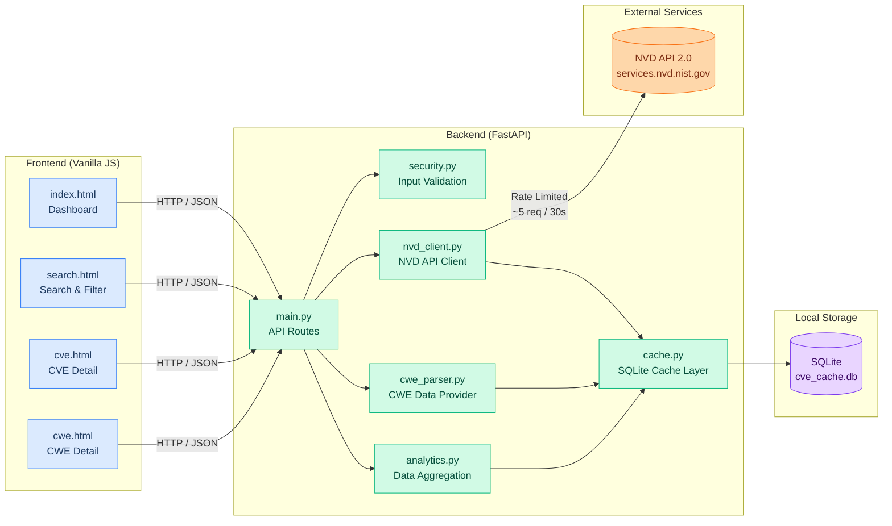
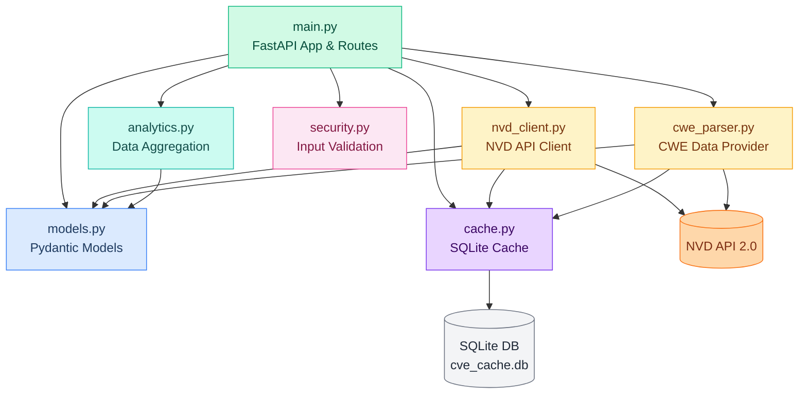
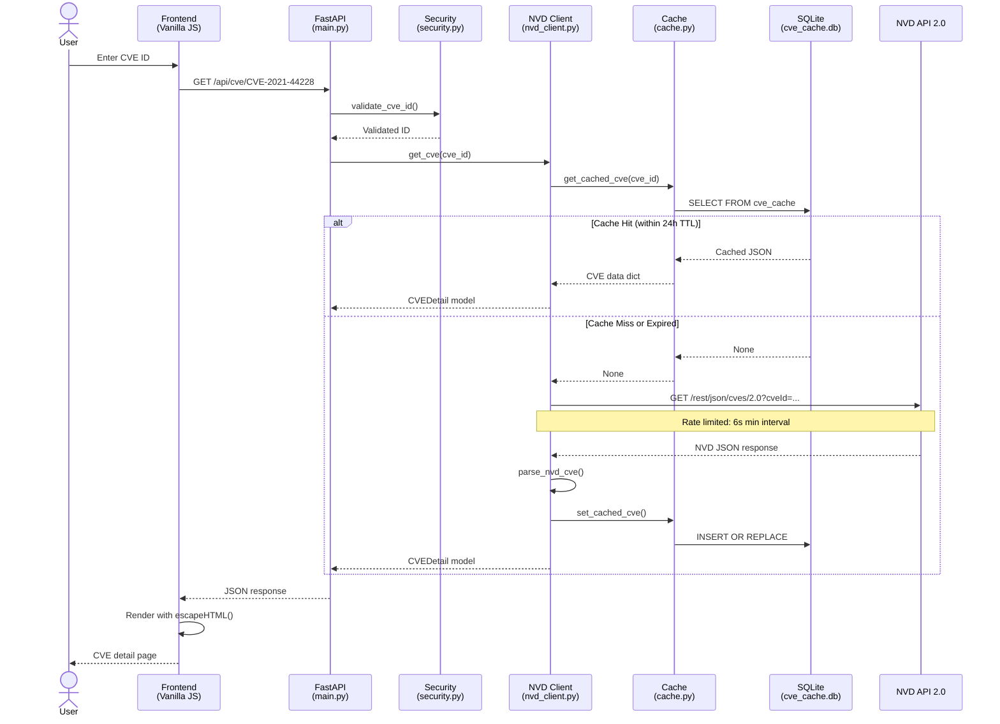
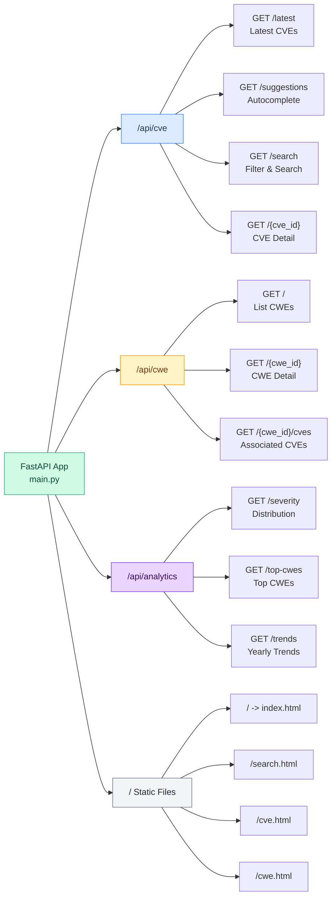
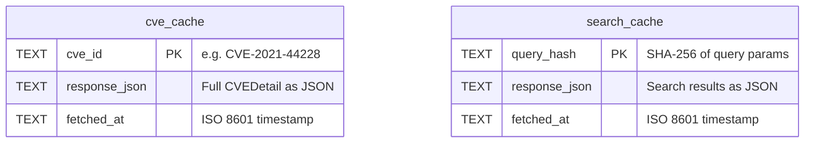
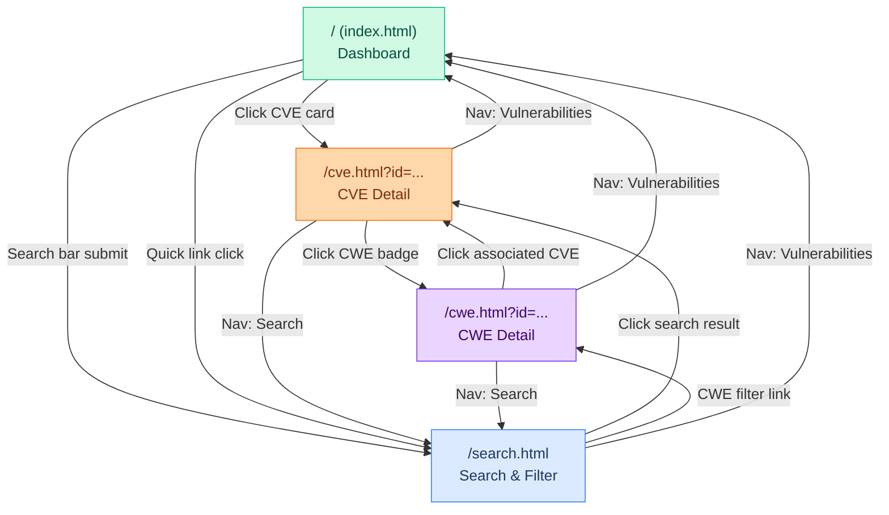
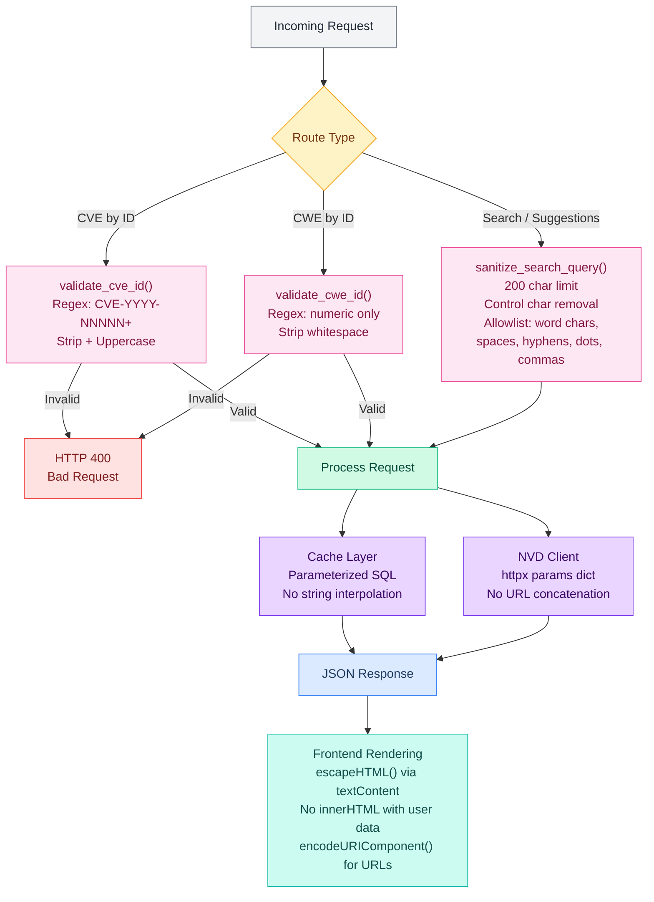
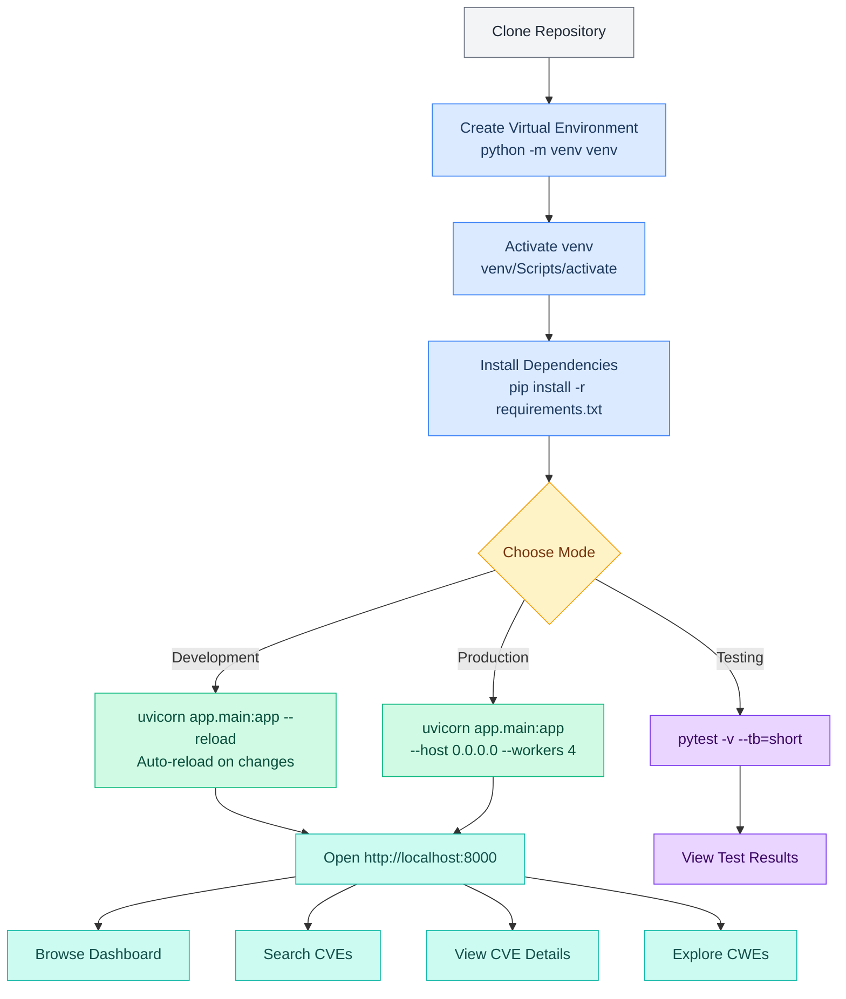

# PureSecure CVE Explorer

**A real-time CVE vulnerability database with CWE mapping, analytics, and intelligent caching.**


---

## Overview

PureSecure CVE Explorer is a web-based security vulnerability database that queries the **NIST National Vulnerability Database (NVD) API 2.0** in real time. It provides a clean, searchable interface for browsing CVEs (Common Vulnerabilities and Exposures), mapping them to CWE (Common Weakness Enumeration) classifications, and visualizing severity analytics.

The backend is built with **FastAPI** and serves a lightweight **vanilla JavaScript** frontend -- no heavy frameworks, no build tools. An **SQLite caching layer** with a 24-hour TTL ensures fast responses while respecting NVD API rate limits. The application includes **37 built-in CWE definitions** for instant lookups, input validation, XSS prevention, and parameterized SQL queries.

All vulnerability data is publicly available from NIST -- no authentication is required.

---

## Features

- **Real-time CVE Search** -- Debounced autocomplete suggestions with keyword, CWE, and severity filters
- **Detailed CVE Views** -- CVSS v2.0 and v3.1 scores with color-coded severity badges
- **CWE Classification Mapping** -- 37 built-in weakness definitions plus live NVD API fallback
- **Severity Filtering** -- Filter by CRITICAL, HIGH, MEDIUM, or LOW
- **Analytics Dashboard** -- Severity distribution, top CWEs, and yearly trend analysis
- **Intelligent Caching** -- SQLite cache with 24-hour TTL for NVD API rate compliance
- **Input Validation** -- Regex-based CVE/CWE ID validation and query sanitization
- **XSS Prevention** -- HTML escaping via `textContent` and `encodeURIComponent` throughout
- **Responsive Design** -- Clean UI with Inter font and CSS custom properties

---

## System Architecture



---

## Tech Stack

| Component | Technology |
|-----------|-----------|
| **Backend Framework** | FastAPI 0.135.1 |
| **ASGI Server** | Uvicorn |
| **Language** | Python 3.10+ |
| **Async HTTP Client** | httpx |
| **Data Validation** | Pydantic v2 |
| **Database** | SQLite3 (caching) |
| **Frontend** | Vanilla JavaScript, HTML5, CSS3 |
| **Font** | Inter (Google Fonts) |
| **Testing** | pytest, respx (HTTP mocking) |
| **Security Scanning** | bandit, flake8 |

---

## Project Structure

```
cve-new-bri/
├── app/                            # Application source code
│   ├── __init__.py
│   ├── main.py                     # FastAPI app, all API routes, static file serving
│   ├── models.py                   # Pydantic models (CVEDetail, CWEEntry, CVSSScores, etc.)
│   ├── nvd_client.py               # NVD API 2.0 client with rate limiting and caching
│   ├── cwe_parser.py               # 37 built-in CWE definitions + live NVD fallback
│   ├── cache.py                    # SQLite cache (cve_cache & search_cache, 24h TTL)
│   ├── analytics.py                # Severity distribution, top CWEs, trend analysis
│   ├── security.py                 # Input validation (CVE/CWE ID regex, query sanitization)
│   └── static/                     # Frontend web assets
│       ├── index.html              # Dashboard homepage with hero banner
│       ├── search.html             # Search page with filters and pagination
│       ├── cve.html                # CVE detail view (CVSS, CWEs, products, references)
│       ├── cwe.html                # CWE detail view with associated CVEs
│       ├── style.css               # Full design system with CSS variables
│       ├── common.js               # Shared utilities (XSS prevention, fetch wrapper)
│       ├── dashboard.js            # Homepage logic and latest CVEs feed
│       ├── search.js               # Search with debounced suggestions and filtering
│       ├── cve.js                  # CVE detail rendering and CVSS display
│       └── cwe.js                  # CWE detail rendering
├── tests/                          # Test suite
│   ├── test_main.py                # API endpoint integration tests
│   ├── test_nvd_client.py          # NVD API client and response parsing tests
│   ├── test_cwe_parser.py          # CWE data provider tests
│   └── test_security.py            # Input validation and sanitization tests
├── data/                           # Auto-created: SQLite cache database
├── pyproject.toml                  # Project metadata, pytest/bandit/flake8 config
└── requirements.txt                # Python dependencies
```

---

## Backend Module Dependencies



---

## Installation & Usage

### Prerequisites

- Python 3.10 or higher
- pip (Python package manager)

### Setup

```bash
# 1. Clone the repository
git clone <repository-url>
cd cve-new-bri

# 2. Create a virtual environment
python -m venv venv

# 3. Activate the virtual environment
# Windows:
venv\Scripts\activate
# macOS / Linux:
source venv/bin/activate

# 4. Install dependencies
pip install -r requirements.txt

# 5. Start the application
uvicorn app.main:app --reload

# 6. Open in browser
# http://localhost:8000
```

> **Note:** The `data/` directory and SQLite database (`cve_cache.db`) are automatically created on the first API request.

---

## Request / Response Data Flow



---

## API Reference

### CVE Endpoints

| Method | Endpoint | Description | Parameters |
|--------|----------|-------------|------------|
| `GET` | `/api/cve/latest` | Most recently published CVEs | `limit` (default: 20, max: 50) |
| `GET` | `/api/cve/suggestions` | Search autocomplete suggestions | `q` (required, min 1 char) |
| `GET` | `/api/cve/search` | Search with filters | `keyword`, `cwe_id`, `severity`, `limit` (max 50), `offset` |
| `GET` | `/api/cve/{cve_id}` | Full CVE details | Path: CVE ID (e.g., `CVE-2021-44228`) |

### CWE Endpoints

| Method | Endpoint | Description | Parameters |
|--------|----------|-------------|------------|
| `GET` | `/api/cwe` | List or search CWEs | `query`, `limit` (default: 10, max: 100) |
| `GET` | `/api/cwe/{cwe_id}` | Single CWE detail | Path: numeric ID (e.g., `79`) |
| `GET` | `/api/cwe/{cwe_id}/cves` | CVEs for a specific CWE | Path: numeric ID |

### Analytics Endpoints

| Method | Endpoint | Description | Parameters |
|--------|----------|-------------|------------|
| `GET` | `/api/analytics/severity` | Severity distribution of cached CVEs | None |
| `GET` | `/api/analytics/top-cwes` | CWEs with most associated CVEs | `limit` (default: 10, max: 50) |
| `GET` | `/api/analytics/trends` | Yearly severity trends | None |

### Example Requests

```bash
# Get latest CVEs
curl http://localhost:8000/api/cve/latest?limit=5

# Search for Log4j vulnerabilities
curl http://localhost:8000/api/cve/search?keyword=log4j

# Get CVE detail
curl http://localhost:8000/api/cve/CVE-2021-44228

# Search CWEs
curl http://localhost:8000/api/cwe?query=injection

# Get severity distribution
curl http://localhost:8000/api/analytics/severity
```

### Example Response -- CVE Detail

```json
{
  "cve_id": "CVE-2021-44228",
  "description": "Apache Log4j2 2.0-beta9 through 2.15.0 JNDI features...",
  "cvss": {
    "v2_score": 9.3,
    "v2_vector": "AV:N/AC:M/Au:N/C:C/I:C/A:C",
    "v3_score": 10.0,
    "v3_vector": "CVSS:3.1/AV:N/AC:L/PR:N/UI:N/S:C/C:H/I:H/A:H",
    "v3_severity": "CRITICAL"
  },
  "cwe_ids": ["CWE-502", "CWE-400", "CWE-917"],
  "references": [
    {
      "url": "https://logging.apache.org/log4j/2.x/security.html",
      "source": "cve@mitre.org",
      "tags": ["Vendor Advisory"]
    }
  ],
  "affected_products": [
    {
      "vendor": "apache",
      "product": "log4j",
      "version": "2.14.1"
    }
  ],
  "published": "2021-12-10T10:15:09.143",
  "modified": "2023-11-06T21:15:09.300"
}
```

---

## API Endpoint Structure



---

## Database / Cache Schema



**Cache behavior:**
- Both tables use `INSERT OR REPLACE` for upserts
- TTL is **24 hours**, checked at read time via `_is_expired()`
- `query_hash` is a SHA-256 hex digest of the serialized query parameter string
- The database file is auto-created at `data/cve_cache.db` on first request

---

## Frontend Navigation Flow



---

## Security Layer



---

## Data Models

All data models are defined in `app/models.py` using Pydantic v2.

| Model | Fields | Purpose |
|-------|--------|---------|
| **CWEEntry** | `id`, `name`, `description` | CWE weakness definition |
| **CVSSScores** | `v2_score`, `v2_vector`, `v3_score`, `v3_vector`, `v3_severity` | CVSS v2/v3 scoring data |
| **AffectedProduct** | `vendor`, `product`, `version` | Vulnerable software from CPE |
| **Reference** | `url`, `source`, `tags` | External advisory links |
| **CVEDetail** | `cve_id`, `description`, `cvss`, `cwe_ids`, `references`, `affected_products`, `published`, `modified` | Full vulnerability record |
| **CVESearchResult** | `cve_id`, `description`, `severity`, `cvss_v3`, `published` | Lightweight search result |
| **SeverityDistribution** | `critical`, `high`, `medium`, `low`, `none` | Severity count statistics |
| **CWEStats** | `cwe_id`, `cwe_name`, `cve_count` | CWE popularity ranking |
| **TrendPoint** | `year`, `severity`, `count` | Yearly severity trend data |

---

## Testing

```bash
# Run all tests
pytest

# Verbose output with short tracebacks (default in pyproject.toml)
pytest -v --tb=short

# Security scanning with bandit
bandit -r app/

# Code style checking with flake8
flake8 app/
```

### Test Modules

| Module | Description |
|--------|-------------|
| `test_main.py` | API endpoint integration tests using `TestClient` and mocked NVD calls |
| `test_nvd_client.py` | NVD response parsing tests with `respx` HTTP mocking |
| `test_cwe_parser.py` | CWE data provider tests (37 built-in entries) |
| `test_security.py` | Input validation tests including SQL injection and XSS payload rejection |

---

## Security Considerations

| Layer | Protection | Implementation |
|-------|-----------|----------------|
| **CVE ID Validation** | Strict regex `^CVE-\d{4}-\d{4,}$` | `security.py` -- rejects malformed IDs |
| **CWE ID Validation** | Numeric-only regex `^\d+$` | `security.py` -- prevents injection |
| **Query Sanitization** | 200 char limit, control char removal, allowlist `[\w\s\-.,]` | `security.py` -- sanitizes all search input |
| **SQL Injection Prevention** | Parameterized queries with `?` placeholders | `cache.py` -- all database operations |
| **XSS Prevention** | `escapeHTML()` via `textContent`, `encodeURIComponent()` | `common.js` -- all frontend rendering |
| **API Rate Limiting** | 6-second minimum interval between NVD requests | `nvd_client.py` -- async sleep-based limiter |
| **No Authentication** | Public data only (NVD is a public database) | By design -- no secrets or user data stored |

---

## Configuration

Key constants and their locations:

| Constant | Value | File | Description |
|----------|-------|------|-------------|
| `TTL_HOURS` | `24` | `app/cache.py:10` | Cache expiration time |
| `DB_PATH` | `data/cve_cache.db` | `app/cache.py:9` | SQLite database location |
| `NVD_BASE_URL` | `https://services.nvd.nist.gov/rest/json/cves/2.0` | `app/nvd_client.py:12` | NVD API endpoint |
| `REQUEST_TIMEOUT` | `30.0` | `app/nvd_client.py:13` | HTTP request timeout (seconds) |
| `_MIN_INTERVAL` | `6.0` | `app/nvd_client.py:17` | Rate limit interval (seconds) |
| `MAX_QUERY_LENGTH` | `200` | `app/security.py:7` | Maximum search query length |

---

## Acknowledgments

- **[NIST NVD](https://nvd.nist.gov/)** -- National Vulnerability Database, the source of all CVE data
- **[MITRE CWE](https://cwe.mitre.org/)** -- Common Weakness Enumeration definitions
- **[FastAPI](https://fastapi.tiangolo.com/)** -- Modern Python web framework

---

## How to Run

### Quick Start

```bash
# 1. Clone and enter the project
git clone <repository-url>
cd cve-new-bri

# 2. Create and activate a virtual environment
python -m venv venv

# Windows
venv\Scripts\activate

# macOS / Linux
source venv/bin/activate

# 3. Install dependencies
pip install -r requirements.txt

# 4. Start the server
uvicorn app.main:app --reload
```

The application will be available at **http://localhost:8000**.

### Run Options

| Command | Description |
|---------|-------------|
| `uvicorn app.main:app --reload` | Development mode with auto-reload on code changes |
| `uvicorn app.main:app --host 0.0.0.0 --port 8000` | Expose to network (accessible from other devices) |
| `uvicorn app.main:app --workers 4` | Production mode with 4 worker processes |

### Run Tests

```bash
# All tests
pytest

# Verbose with short tracebacks
pytest -v --tb=short

# Security scan
bandit -r app/

# Lint check
flake8 app/
```

### Run with Environment Variables

```bash
# Optional: Set NVD API key for higher rate limits (50 req/30s vs 5 req/30s)
export NVD_API_KEY=your-api-key-here

# Start the server
uvicorn app.main:app --reload
```

### Verify It Works

Once running, open your browser and try:

1. **Dashboard** -- http://localhost:8000 (latest CVEs feed)
2. **Search** -- http://localhost:8000/search.html?keyword=log4j
3. **CVE Detail** -- http://localhost:8000/cve.html?id=CVE-2021-44228
4. **API directly** -- http://localhost:8000/api/cve/latest

### Run Workflow


