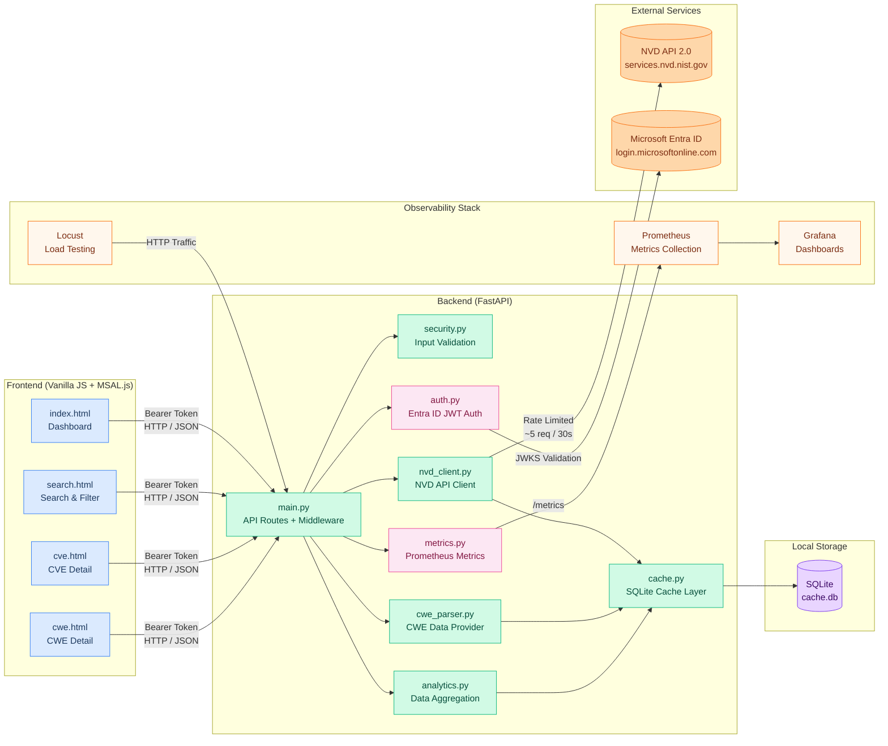
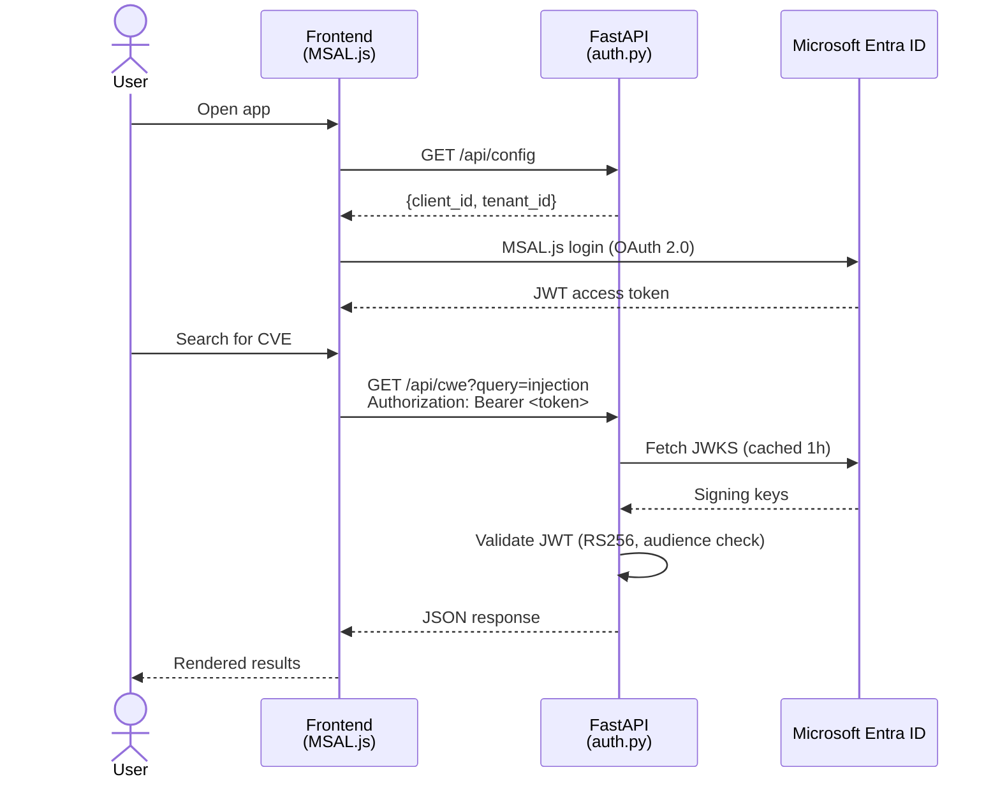
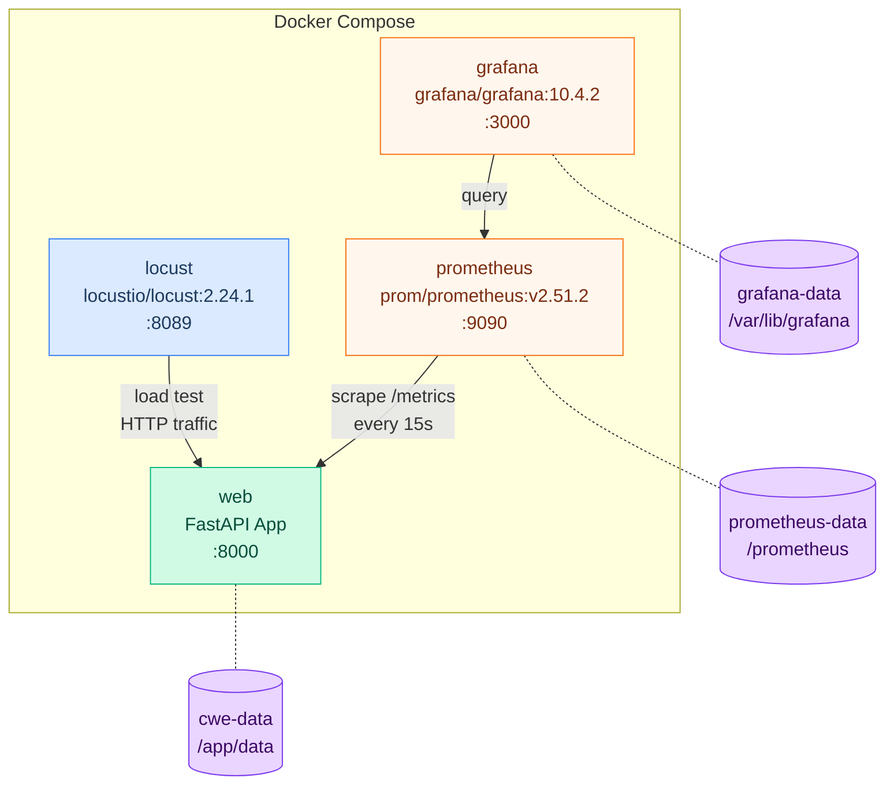
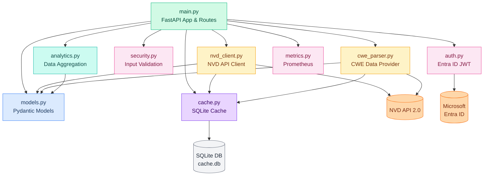
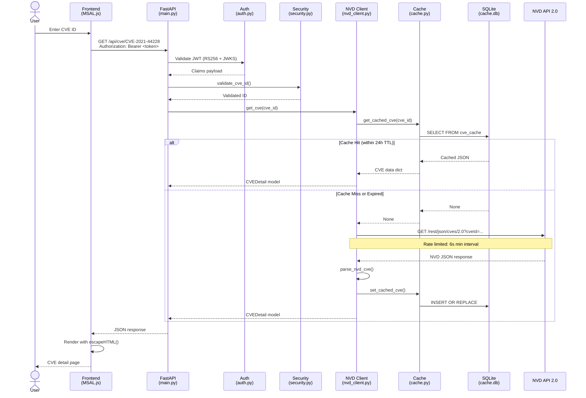
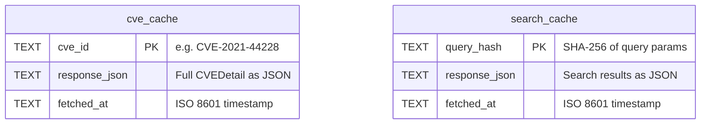

# PureSecure CVE Explorer

**A real-time CVE vulnerability database with CWE mapping, analytics, observability, and Azure Entra ID authentication.**


---

## Overview

PureSecure CVE Explorer is a web-based security vulnerability database that queries the **NIST National Vulnerability Database (NVD) API 2.0** in real time. It provides a clean, searchable interface for browsing CVEs (Common Vulnerabilities and Exposures), mapping them to CWE (Common Weakness Enumeration) classifications, and visualizing severity analytics.

The backend is built with **FastAPI** and serves a lightweight **vanilla JavaScript** frontend. An **SQLite caching layer** with a 24-hour TTL ensures fast responses while respecting NVD API rate limits. All API endpoints (except health and config) are protected by **Microsoft Entra ID (Azure AD) JWT authentication**. The full stack runs in **Docker Compose** with integrated **Prometheus** metrics, **Grafana** dashboards, and **Locust** load testing.

---

## Features

- **Real-time CVE Search** -- Debounced autocomplete suggestions with keyword, CWE, and severity filters
- **Detailed CVE Views** -- CVSS v2.0 and v3.1 scores with color-coded severity badges
- **CWE Classification Mapping** -- 37 built-in weakness definitions plus live NVD API fallback
- **Severity Filtering** -- Filter by CRITICAL, HIGH, MEDIUM, or LOW
- **Analytics Dashboard** -- Severity distribution, top CWEs, and risk scoring
- **Azure Entra ID Authentication** -- JWT-based auth via MSAL.js and Microsoft JWKS
- **Prometheus Metrics** -- Request count, latency histograms, error rates, and in-progress gauges
- **Grafana Dashboards** -- Pre-provisioned dashboard with 18 panels across 5 sections
- **Locust Load Testing** -- Pre-built scenarios covering all API endpoints
- **Intelligent Caching** -- SQLite cache with 24-hour TTL and startup cleanup
- **Request Logging** -- Structured logs with method, path, status, and duration
- **Input Validation** -- Regex-based CVE/CWE ID validation and query sanitization
- **XSS Prevention** -- HTML escaping via `textContent` and `encodeURIComponent`
- **Dockerized** -- Single `docker compose up` deploys the full stack

---

## System Architecture



---

## Tech Stack

| Component | Technology |
|-----------|------------|
| **Backend Framework** | FastAPI 0.135.1 |
| **ASGI Server** | Uvicorn |
| **Language** | Python 3.10+ |
| **Async HTTP Client** | httpx |
| **Data Validation** | Pydantic v2 |
| **Database** | SQLite3 (caching, WAL mode) |
| **Authentication** | Microsoft Entra ID (Azure AD) via PyJWT + JWKS |
| **Metrics** | prometheus-client (Counter, Histogram, Gauge) |
| **Monitoring** | Prometheus v2.51.2 + Grafana 10.4.2 |
| **Load Testing** | Locust 2.24.1 |
| **XML Security** | defusedxml (XXE prevention) |
| **Frontend** | Vanilla JavaScript, HTML5, CSS3, MSAL.js |
| **Containerization** | Docker + Docker Compose |
| **Testing** | pytest, respx (HTTP mocking) |
| **Security Scanning** | bandit, flake8 |

---

## Project Structure

```
cve-new-bri/
├── app/                                # Application source code
│   ├── __init__.py
│   ├── main.py                         # FastAPI app, routes, middleware, lifespan
│   ├── models.py                       # Pydantic models (CVEDetail, CWEEntry, etc.)
│   ├── auth.py                         # Microsoft Entra ID JWT validation (JWKS)
│   ├── metrics.py                      # Prometheus middleware (count, latency, gauge)
│   ├── nvd_client.py                   # NVD API 2.0 client with rate limiting
│   ├── cwe_parser.py                   # 37 built-in CWE definitions + NVD fallback
│   ├── cache.py                        # SQLite cache (WAL mode, 24h TTL, cleanup)
│   ├── analytics.py                    # Top CWEs, risk scoring
│   ├── security.py                     # Input validation (CVE/CWE regex, sanitization)
│   └── static/                         # Frontend web assets
│       ├── index.html                  # Dashboard homepage
│       ├── search.html                 # Search with filters and pagination
│       ├── cve.html                    # CVE detail view (CVSS, CWEs, products)
│       ├── cwe.html                    # CWE detail view with associated CVEs
│       ├── login.html                  # Microsoft Entra ID login page
│       ├── 404.html                    # Custom 404 error page
│       ├── style.css                   # Design system with CSS variables
│       ├── common.js                   # Shared utilities (XSS prevention, fetch)
│       ├── auth.js                     # MSAL.js authentication logic
│       ├── dashboard.js                # Homepage logic
│       ├── search.js                   # Search with debounced suggestions
│       ├── cve.js                      # CVE detail rendering
│       └── cwe.js                      # CWE detail rendering
├── monitoring/                         # Observability configuration
│   ├── prometheus/
│   │   ├── prometheus.yml              # Scrape config (15s interval)
│   │   └── rules/
│   │       ├── recording_rules.yml     # 17 pre-computed queries
│   │       └── alerting_rules.yml      # 11 alert rules (errors, latency, traffic)
│   └── grafana/
│       ├── provisioning/
│       │   ├── datasources/
│       │   │   └── datasource.yml      # Auto-configure Prometheus datasource
│       │   └── dashboards/
│       │       └── dashboard.yml       # Auto-load dashboard JSON
│       └── dashboards/
│           └── cwe-explorer.json       # 18-panel monitoring dashboard
├── locust/
│   └── locustfile.py                   # Load test scenarios (all endpoints)
├── tests/                              # Test suite
│   ├── test_main.py                    # API endpoint integration tests
│   ├── test_auth.py                    # Authentication / JWT validation tests
│   ├── test_cwe_parser.py              # CWE data provider tests
│   ├── test_nvd_client.py              # NVD response parser tests
│   └── test_security.py               # Input validation tests
├── data/                               # Auto-created: SQLite cache database
├── docs/
│   └── REPORT.md                       # Security design report
├── .env.example                        # Environment variable template
├── Dockerfile                          # Multi-stage Python 3.10-slim image
├── docker-compose.yml                  # Full stack: web, prometheus, grafana, locust
├── requirements.txt                    # Python dependencies
├── requirements-dev.txt                # Dev dependencies (pytest, bandit, flake8)
├── pyproject.toml                      # Project metadata, tool config
├── .gitignore
└── .dockerignore
```

---

## Installation & Usage

### Option 1: Docker Compose (Recommended)

This deploys the full stack: API, Prometheus, Grafana, and Locust.

```bash
# 1. Clone the repository
git clone <repository-url>
cd cve-new-bri

# 2. Create a .env file with your Azure Entra ID credentials
echo "AZURE_TENANT_ID=your-tenant-id" > .env
echo "AZURE_CLIENT_ID=your-client-id" >> .env

# 3. Build and start all services
docker compose up --build
```

#### Service URLs

| Service | URL | Credentials |
|---------|-----|-------------|
| **CWE Explorer API** | http://localhost:8000 | Azure Entra ID token |
| **API Docs (Swagger)** | http://localhost:8000/docs | — |
| **Prometheus** | http://localhost:9090 | — |
| **Grafana** | http://localhost:3000 | See `.env` (`GF_ADMIN_USER` / `GF_ADMIN_PASSWORD`) |
| **Locust** | http://localhost:8089 | — |

### Option 2: Local Development

```bash
# 1. Clone and enter the project
git clone <repository-url>
cd cve-new-bri

# 2. Create and activate a virtual environment
python -m venv venv

# Windows
venv\Scripts\activate

# macOS / Linux
source venv/bin/activate

# 3. Install dependencies
pip install -r requirements.txt

# 4. Set environment variables
set AZURE_TENANT_ID=your-tenant-id
set AZURE_CLIENT_ID=your-client-id

# 5. Start the server
uvicorn app.main:app --reload

# 6. Open in browser: http://localhost:8000
```

### Run Tests

```bash
# Install dev dependencies
pip install -r requirements-dev.txt

# Run all tests
pytest

# Verbose with short tracebacks
pytest -v --tb=short

# Security scan
bandit -r app/

# Lint check
flake8 app/
```

---

## Authentication

All API endpoints except `/api/health`, `/api/config`, and `/metrics` require a valid **Microsoft Entra ID (Azure AD) Bearer token**.

### How It Works



### Configuration

| Environment Variable | Description |
|---------------------|-------------|
| `AZURE_TENANT_ID` | Your Azure AD tenant ID |
| `AZURE_CLIENT_ID` | App registration client ID (used as JWT `audience`) |

The auth module (`app/auth.py`) uses the Microsoft common JWKS endpoint with issuer validation disabled to support multi-tenant and personal Microsoft accounts.

---

## API Reference

### Public Endpoints (No Auth)

| Method | Endpoint | Description |
|--------|----------|-------------|
| `GET` | `/api/health` | Health check with cache stats |
| `GET` | `/api/config` | Entra ID client config for MSAL.js |
| `GET` | `/metrics` | Prometheus metrics (text format) |

### CWE Endpoints (Auth Required)

| Method | Endpoint | Description | Parameters |
|--------|----------|-------------|------------|
| `GET` | `/api/cwe` | List or search CWEs | `query`, `limit` (default: 10, max: 100) |
| `GET` | `/api/cwe/suggestions` | Autocomplete suggestions | `q` (required, min 1 char) |
| `GET` | `/api/cwe/{cwe_id}` | Single CWE detail | Path: numeric ID (e.g., `79`) |
| `GET` | `/api/cwe/{cwe_id}/cves` | CVEs for a specific CWE | Path: numeric ID |

### CVE Endpoints (Auth Required)

| Method | Endpoint | Description | Parameters |
|--------|----------|-------------|------------|
| `GET` | `/api/cve/{cve_id}` | Full CVE details | Path: CVE ID (e.g., `CVE-2021-44228`) |

### Analytics Endpoints (Auth Required)

| Method | Endpoint | Description | Parameters |
|--------|----------|-------------|------------|
| `GET` | `/api/analytics/top-cwes` | CWEs with most associated CVEs | `limit` (default: 10, max: 50) |
| `GET` | `/api/analytics/cwe-risk` | CWE risk scores (frequency × severity) | `limit` (default: 15, max: 50) |

### Example Requests

```bash
# Health check (no auth)
curl http://localhost:8000/api/health

# Prometheus metrics (no auth)
curl http://localhost:8000/metrics

# Search CWEs (requires Bearer token)
curl -H "Authorization: Bearer <token>" \
  http://localhost:8000/api/cwe?query=injection

# Get CVE detail (requires Bearer token)
curl -H "Authorization: Bearer <token>" \
  http://localhost:8000/api/cve/CVE-2021-44228
```

### Example Response -- Health Check

```json
{
  "status": "healthy",
  "cwe_count": 937,
  "cache": {
    "cve_entries": 42,
    "search_entries": 8,
    "db_size_bytes": 462848
  }
}
```

---

## Observability

### Prometheus Metrics

The FastAPI app exposes a `/metrics` endpoint with the following metrics:

| Metric | Type | Description |
|--------|------|-------------|
| `http_requests_total` | Counter | Total requests by method, endpoint, status |
| `http_request_duration_seconds` | Histogram | Request latency with percentile-friendly buckets |
| `http_requests_in_progress` | Gauge | Currently active requests |

Path normalization prevents high-cardinality label explosion (e.g., `/api/cwe/79` → `/api/cwe/{id}`).

### Recording Rules (Pre-computed Queries)

17 recording rules in `monitoring/prometheus/rules/recording_rules.yml`:

| Query | What It Computes |
|-------|------------------|
| `cwe:http_requests:rate1m` | Total requests/sec |
| `cwe:http_requests_by_endpoint:rate1m` | Requests/sec per endpoint |
| `cwe:http_errors_5xx:rate1m` | Server error rate |
| `cwe:http_error_ratio_5xx` | % of requests returning 5xx |
| `cwe:http_latency_p50:5m` | Median response time |
| `cwe:http_latency_p95:5m` | 95th percentile latency |
| `cwe:http_latency_p99:5m` | 99th percentile latency |
| `cwe:http_availability:5m` | Availability % (1 − error ratio) |
| `cwe:http_in_progress:total` | Current concurrent requests |

### Alerting Rules

11 alerting rules in `monitoring/prometheus/rules/alerting_rules.yml`:

| Alert | Condition | Severity |
|-------|-----------|----------|
| **APIDown** | `/metrics` unreachable 2 min | Critical |
| **HighServerErrorRate** | > 5% of requests are 5xx | Critical |
| **LowAvailability** | Availability < 99% | Critical |
| **TrafficSpike** | 10× normal request rate | Critical |
| **CriticalP95Latency** | p95 > 5 seconds | Critical |
| **HighClientErrorRate** | > 25% requests are 4xx | Warning |
| **HighP95Latency** | p95 > 1 second | Warning |
| **HighP99Latency** | p99 > 3 seconds | Warning |
| **SlowEndpoint** | Any endpoint p95 > 2s | Warning |
| **NoTraffic** | Zero requests 10 min | Warning |
| **HighConcurrency** | > 50 in-progress requests | Warning |

### Grafana Dashboard

The pre-provisioned dashboard ("CWE Explorer -- API Monitoring") has 18 panels in 5 sections:

1. **📊 Overview** -- Total, 2xx, 4xx, 5xx request counts (stat panels)
2. **🚦 Traffic** -- Requests/sec, cumulative traffic, pie charts by endpoint/method/status
3. **⏱️ Latency** -- p50/p95/p99 percentiles, per-endpoint p95, avg bar gauge, heatmap
4. **🔴 Errors & Connections** -- 5xx error rate, in-progress requests
5. **📋 Request Log** -- Full table of all requests with method, endpoint, status, count, rate, and avg response time

### Locust Load Testing

The `locust/locustfile.py` defines weighted scenarios:

| Scenario | Weight | Endpoint |
|----------|--------|----------|
| List CWEs | 5 | `GET /api/cwe` |
| Search CWEs | 4 | `GET /api/cwe?query=...` |
| CWE Detail | 3 | `GET /api/cwe/{id}` |
| Suggestions | 3 | `GET /api/cwe/suggestions` |
| CWE CVEs | 2 | `GET /api/cwe/{id}/cves` |
| Top CWEs | 2 | `GET /api/analytics/top-cwes` |
| Risk Scores | 1 | `GET /api/analytics/cwe-risk` |
| Health Check | 1 | `GET /` |

Access the Locust UI at http://localhost:8089 to configure users and spawn rate.

---

## Docker Architecture



---

## Backend Module Dependencies



---

## Security

### Security Layers

| Layer | Protection | Implementation |
|-------|-----------|----------------|
| **Authentication** | Microsoft Entra ID JWT (RS256, audience validation) | `auth.py` -- JWKS cached 1h, multi-tenant support |
| **CORS** | Origin allowlist, restricted methods/headers | `main.py` -- only localhost:8000 origins, GET only |
| **CVE ID Validation** | Strict regex `^CVE-\d{4}-\d{4,}$` | `security.py` -- rejects malformed IDs |
| **CWE ID Validation** | Numeric-only regex `^\d+$` | `security.py` -- prevents injection |
| **Query Sanitization** | 200 char limit, allowlist `[\w\s\-.,]` | `security.py` -- sanitizes all search input |
| **SQL Injection Prevention** | Parameterized queries with `?` placeholders | `cache.py` -- all database operations |
| **XXE Prevention** | `defusedxml` instead of stdlib XML | `cwe_parser.py` -- blocks entity injection |
| **XSS Prevention** | `escapeHTML()` via `textContent` | `common.js` -- all frontend rendering |
| **Non-root Container** | `appuser:appgroup` in Docker | `Dockerfile` -- least privilege |
| **Rate Limiting** | 6-second min interval for NVD requests | `nvd_client.py` -- async sleep-based |

### Request / Response Data Flow



---

## Database / Cache Schema



**Cache behavior:**
- Both tables use `INSERT OR REPLACE` for upserts
- TTL is **24 hours**, checked at read time via `_is_expired()`
- Expired entries are cleaned up at startup via `cleanup_expired()`
- WAL journal mode enables concurrent reads without blocking writes
- `query_hash` is a SHA-256 hex digest of the serialized query parameters
- The database file is auto-created at `data/cache.db`

---

## Data Models

All data models are defined in `app/models.py` using Pydantic v2.

| Model | Fields | Purpose |
|-------|--------|---------|
| **CWEEntry** | `id`, `name`, `description` | CWE weakness definition |
| **CVSSScores** | `v2_score`, `v2_vector`, `v3_score`, `v3_vector`, `v3_severity` | CVSS v2/v3 scoring data |
| **AffectedProduct** | `vendor`, `product`, `version` | Vulnerable software from CPE |
| **Reference** | `url`, `source`, `tags` | External advisory links |
| **CVEDetail** | `cve_id`, `description`, `cvss`, `cwe_ids`, `references`, `affected_products`, `published`, `modified` | Full vulnerability record |
| **CVESearchResult** | `cve_id`, `description`, `severity`, `cvss_v3`, `published` | Lightweight search result |
| **CWEStats** | `cwe_id`, `cwe_name`, `cve_count` | CWE popularity ranking |
| **CWERiskScore** | `cwe_id`, `cwe_name`, `risk_score`, ... | Composite risk ranking |

---

## Configuration

| Variable / Constant | Value | Location | Description |
|---------------------|-------|----------|-------------|
| `AZURE_TENANT_ID` | (env var) | `docker-compose.yml` | Azure AD tenant ID |
| `AZURE_CLIENT_ID` | (env var) | `docker-compose.yml` | App registration client ID |
| `TTL_HOURS` | `24` | `app/cache.py` | Cache expiration time |
| `DB_PATH` | `data/cache.db` | `app/cache.py` | SQLite database location |
| `NVD_BASE_URL` | `services.nvd.nist.gov/...` | `app/nvd_client.py` | NVD API endpoint |
| `REQUEST_TIMEOUT` | `30.0` | `app/nvd_client.py` | HTTP timeout (seconds) |
| `_MIN_INTERVAL` | `6.0` | `app/nvd_client.py` | Rate limit interval |
| `MAX_QUERY_LENGTH` | `200` | `app/security.py` | Max search query length |
| `_JWKS_TTL` | `1 hour` | `app/auth.py` | JWKS key cache duration |

---

## Testing

### Test Modules

| Module | Description |
|--------|-------------|
| `test_main.py` | API endpoint integration tests using `TestClient` and mocked NVD calls |
| `test_auth.py` | Authentication and JWT validation tests (token rejection, public endpoints) |
| `test_cwe_parser.py` | CWE data provider tests (XML parsing + fallback) |
| `test_nvd_client.py` | NVD response parser tests (CVSS v2/v3, CWE IDs, CPE products, dates) |
| `test_security.py` | Input validation tests including SQL injection and XSS payload rejection |

---

## CI/CD Pipeline

The project uses a GitHub Actions pipeline (`.github/workflows/ci-cd.yml`) with 8 stages following the shift-left security principle:

| Stage | Tool | Purpose |
|-------|------|---------|
| 1. Lint | Flake8 | Code quality and PEP 8 compliance |
| 2. SAST | Bandit | Python security pattern analysis |
| 3. SAST | CodeQL | Semantic code analysis (Python + JavaScript) |
| 4. SCA | Safety + pip-audit | Dependency vulnerability scanning |
| 5. Secrets | Gitleaks | Detect committed secrets in git history |
| 6. SBOM | CycloneDX | Software Bill of Materials (JSON + XML) |
| 7. Test | pytest | Unit and integration tests with coverage |
| 8. Docker | Docker Build & Push | Build image and push to DockerHub |

Stages 1--7 run in parallel on every push and pull request. Stage 8 runs only on push to `main`/`master` after all other stages pass.

### DockerHub Deployment

The pipeline automatically builds the Docker image and pushes it to DockerHub with two tags:

- **`latest`** -- always points to the most recent main branch build
- **`<short-sha>`** -- the 7-character commit SHA for precise version tracking

**Required repository secrets:**

| Secret | Description |
|--------|-------------|
| `DOCKERHUB_USERNAME` | DockerHub account username |
| `DOCKERHUB_TOKEN` | DockerHub access token ([create one here](https://hub.docker.com/settings/security)) |

### Running the Pipeline Locally

```bash
# Lint
flake8 app/ tests/ --max-line-length=100

# Security scan
bandit -r app/ -ll

# Tests with coverage
pytest tests/ -v --tb=short --cov=app

# Docker build (local)
docker build -t puresecure-cve-explorer .
```

---

## Acknowledgments

- **[NIST NVD](https://nvd.nist.gov/)** -- National Vulnerability Database, the source of all CVE data
- **[MITRE CWE](https://cwe.mitre.org/)** -- Common Weakness Enumeration definitions
- **[FastAPI](https://fastapi.tiangolo.com/)** -- Modern Python web framework
- **[Prometheus](https://prometheus.io/)** -- Metrics collection and alerting
- **[Grafana](https://grafana.com/)** -- Observability dashboards
- **[Locust](https://locust.io/)** -- Load testing framework
- **[Microsoft Entra ID](https://learn.microsoft.com/en-us/entra/)** -- Identity platform
